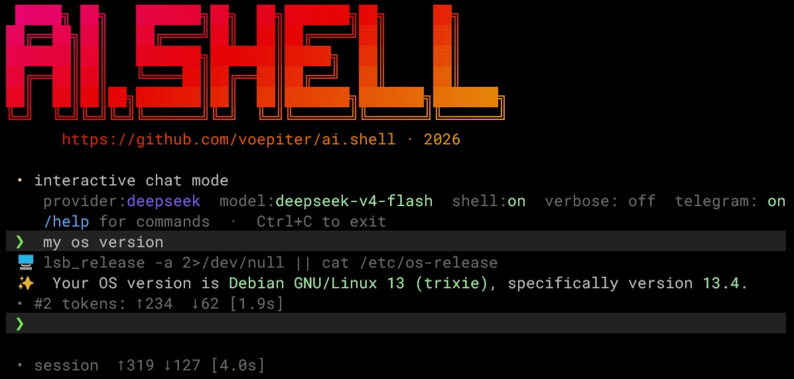

[English](README.md) | [Русский](README.ru.md)



# AI.SHELL

AI terminal interface with a built-in agent. can run shell commands. Supports APIs: OpenRouter, DeepSeek, OpenAI ChatGPT, Anthropic Claude, Google Gemini, XAI Grok.

## Installation

Recommended via the UV package manager.

If not installed:

```bash
curl -LsSf https://astral.sh/uv/install.sh | sh
```

Install AI.SHELL:

```bash
uv tool install git+https://github.com/voepiter/ai.shell.git
```

### Update

```bash
uv tool upgrade ai.shell
```

## Configuration

The `ai.ini` file is created on first run by a setup wizard. Default settings come from `ai.ini.default`.

### API Keys

Access to LLM models requires API keys.
They can be set via environment variables or in `ai.ini` under the `[api_keys]` section:

| Provider         | Environment variable |
|------------------|----------------------|
| DeepSeek         | `DEEPSEEK_API_KEY`   |
| Anthropic Claude | `ANTHROPIC_API_KEY`  |
| OpenAI ChatGPT   | `OPENAI_API_KEY`     |
| XAI Grok         | `XAI_API_KEY`        |
| Google Gemini    | `GOOGLE_API_KEY`     |
| OpenRouter       | `OPENROUTER_API_KEY` |

## Usage

```bash
# Interactive mode with bash agent
ai

# Single-turn query
ai "your question"

# Select provider and model
ai -p openai -m gpt-5.3-mini "your question"

# System instruction
ai -i "You are a Python expert" "write a sorting function"

# List providers
ai -lp
# List models
ai -p openrouter -lm
```

## Command-line Options

| Option                    | Description                  |
|---------------------------|------------------------------|
| `"prompt"`                | Query text for the AI        |
| `-h` / `--help`           | Show help                    |
| `-l` / `--language`       | Select language              |
| `-i` / `--instruction`    | System instruction           |
| `-p` / `--provider`       | Provider                     |
| `-m` / `--model`          | Model name                   |
| `-lp`/ `--list-providers` | List available providers     |
| `-lm`/ `--list-models`    | List available models        |
| `-v` / `--verbose`        | Show bash commands and output in agent mode (single-turn only; interactive reads from `ai.ini`) |

## Verbose Mode

Controls whether intermediate bash commands and their output are shown during agent execution. The final answer is always displayed.

| Mode          | Default | How to change                          |
|---------------|---------|----------------------------------------|
| Interactive   | `true`  | Set `verbose = true/false` in `ai.ini` `[shell]`, or toggle with `/verbose` |
| Single-turn   | `false` | Pass `-v` / `--verbose` flag           |

```bash
# Single-turn with verbose output
ai -v "show disk usage"
```

## Session Management

Each interactive session is saved as a JSONL file in `~/.local/share/ai-shell/log/` (or `log/` when running from source).

| Command                   | Description                                        |
|---------------------------|----------------------------------------------------|
| `/sessions`               | List the 10 most recent sessions with last prompt  |
| `/resume <session_id>`    | Load a previous session and continue the dialogue  |
| `/verbose [true\|false]`  | Toggle display of bash commands in agent mode      |

```bash
# List recent sessions
/sessions

# Resume a previous session
/resume 20260511_143022
```

## Supported Providers

| Provider    | Default model        |
|-------------|----------------------|
| OpenRouter  | `openrouter/free`    |
| DeepSeek    | `deepseek-v4-flash`  |
| OpenAI      | `gpt-5.4-mini`       |
| Anthropic   | `claude-sonnet-4-6`  |
| Google      | `gemini-2.5-flash`   |
| XAI         | `grok-4.1-fast`      |

OpenRouter provides access to many models through a single API key.
Free models have the `free` suffix. Full list: `ai -p openrouter -lm`
